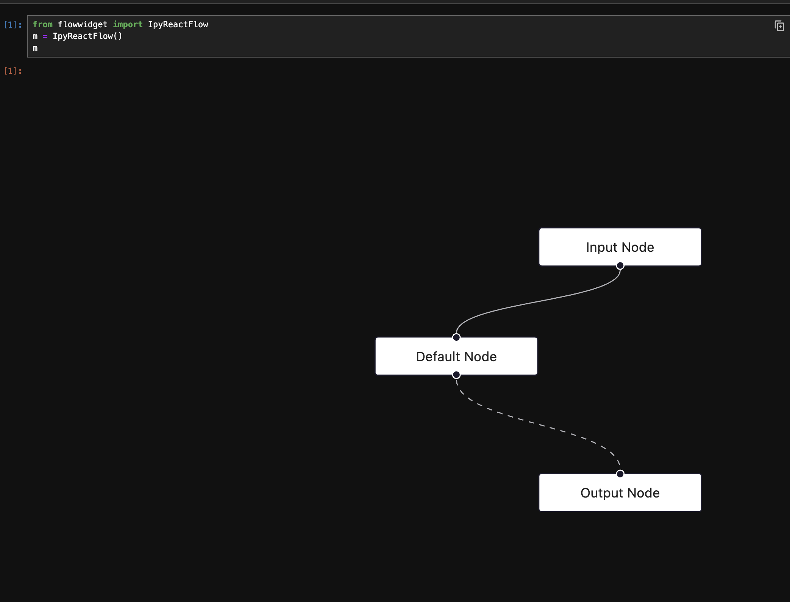

# Ipyreactflow-made-with-vite (no hot module replacement here though)


```

Example script:

```python
from ipymafs import MafsWidget
m = MafsWidget()
m
``````


https://github.com/kolibril13/ipymafs/assets/44469195/e1255d4e-6ea4-4870-8361-167c0d9689d5

